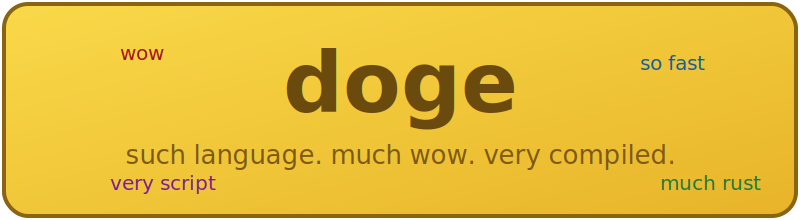

<p align="center">
  
</p>

## Why doge?

Doge is a scripting language inspired by Python's ease of use and Rust's engine
underneath. Rust's skill floor (ownership, lifetimes, the borrow checker) is too
high for casual scripting; Python proved that a clear, low-ceremony language is
what most people reach for. Doge aims to be that language:

- Written in Rust, following Rust memory best practices (no GC; reference counting
  in the runtime; no `unsafe`).
- Transpiled to Rust: a `.doge` script is compiled to Rust source and built with
  `rustc`, producing a native binary. You get native performance without ever
  seeing Rust.
- Wrapped in the doge meme: keywords come from doge-speak where it helps
  readability and fun, and stay universal (`if`, `for`, `while`) where convention
  is stronger than the meme.

```doge
so nerd

such greet much name:
    bark "much hello " + name
wow

for shibe in ["kabosu", "cheems", "walter"]:
    pls
        greet(shibe)
    oh no err!
        bark "very error: " + err

bark "sqrt of 16 is " + str(nerd.sqrt(16))
wow
```

## Installation

Doge needs a Rust toolchain, both to install and to compile your scripts. Get one
from [rustup.rs](https://rustup.rs) if you don't have it.

```sh
git clone https://github.com/DogeLanguage/doge
cd doge
cargo install --path crates/doge-cli
```

Check that it worked:

```sh
doge bark examples/hello.doge
```

The first run of a script pays the Rust compile time (a few seconds). After that
the binary is cached in `~/.cache/doge/`, so running an unchanged script is
instant.

## Usage

| Command | Effect |
|---|---|
| `doge bark script.doge` | compile (cached) and run |
| `doge build script.doge` | compile and copy the binary to `./<script-stem>` |
| `doge check script.doge` | parse and check only, no build |

The `examples/` folder is a good tour of the language; start with
`examples/tour.doge`.

## Documentation

| Document | Contents |
|---|---|
| [docs/SYNTAX.md](docs/SYNTAX.md) | Keywords, literals, variables, control flow, functions, error handling, objects, imports |
| [docs/GRAMMAR.md](docs/GRAMMAR.md) | Grammar sketch (EBNF) and disambiguation rules |
| [docs/STDLIB.md](docs/STDLIB.md) | Builtins and the `nerd`, `strings`, `lists` modules |
| [docs/ERRORS.md](docs/ERRORS.md) | Diagnostic and runtime error message style |
| [docs/ARCHITECTURE.md](docs/ARCHITECTURE.md) | Compiler pipeline, crate layout, runtime model, codegen |
| [docs/CLI.md](docs/CLI.md) | The `doge` binary and the build cache |

## Status

The core language works end-to-end: variables, control flow, functions,
`pls`/`oh no` error handling, `many Name:` objects, and the `nerd`/`strings`/
`lists` stdlib modules. Remaining features (closures, first-class functions,
importing `.doge` files, a REPL) are tracked as
[issues](https://github.com/DogeLanguage/doge/issues).

## License

Apache 2.0, see [LICENSE](LICENSE).
