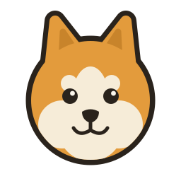

<p align="center">
  
</p>

<h1 align="center"><code>.doge</code></h1>

<p align="center"><em>much type &middot; very safe &middot; wow</em></p>

---

## The mark

A rounded, geometric Shiba — built from arcs and circles so it stays friendly at any size, in the classic tan / cream / dark-ink palette.

<p align="center">
  
  &nbsp;&nbsp;&nbsp;&nbsp;
  
</p>

## Palette

| Role | Hex |
| --- | --- |
| Amber (fur) | `#E39B3C` |
| Deep amber (ears / accent) | `#C8842B` |
| Cream (face) | `#F6ECD8` |
| Ink (outline / features) | `#2A231C` |
| Paper (background) | `#FBF6EC` |

## Files

```
assets/
├── doge-mark.svg                 # primary mark (transparent)
├── doge-lockup-horizontal.svg    # mark + ".doge" wordmark
├── doge-banner.svg               # README / social banner
└── favicon.svg                   # favicon (vector)
Icon Exporter.html                # generates every PNG + favicon.ico
```

## Generating the raster icons

Open **`Icon Exporter.html`** in any browser and hit **Download everything**. It renders each icon from the master geometry and gives you:

- `favicon.ico` (16 · 32 · 48) and `favicon-16/32/48/64.png`
- `apple-touch-icon.png` (180), `icon-192.png`, `icon-512.png`
- `doge-avatar-512.png` / `doge-avatar-1024.png` — square tile for the GitHub org avatar
- `doge-banner.png` — raster banner
- `doge-mark-1024.png` — transparent hi-res mark

## Favicon setup

Drop the files at your site root and add:

```html
<link rel="icon" href="/favicon.ico" sizes="any">
<link rel="icon" type="image/svg+xml" href="/favicon.svg">
<link rel="apple-touch-icon" href="/apple-touch-icon.png">
```

## Usage notes

- Keep clear space around the mark equal to roughly one ear-height.
- Don't recolor the fur outside the amber / cream / ink palette, rotate the head, or stretch it.
- Use the transparent mark on light surfaces; use the cream-tile versions where you need an opaque icon (avatars, touch icons).
